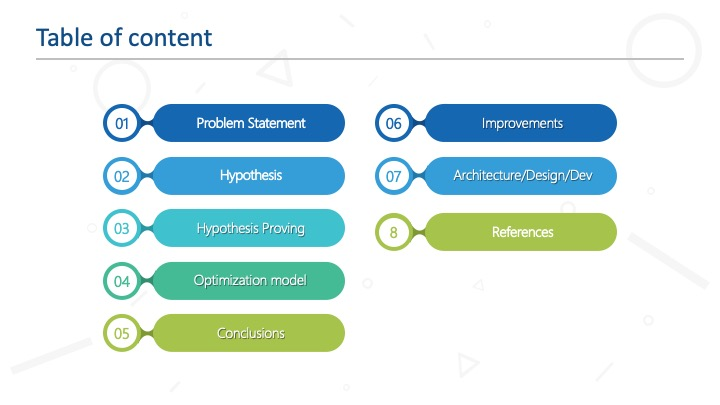
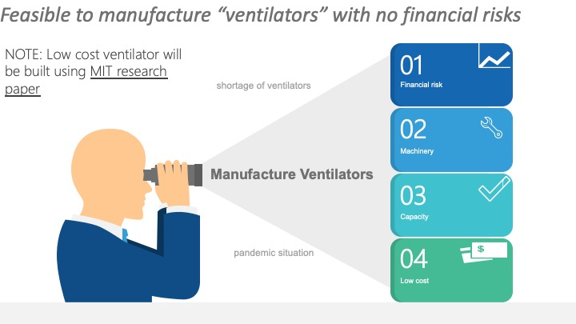
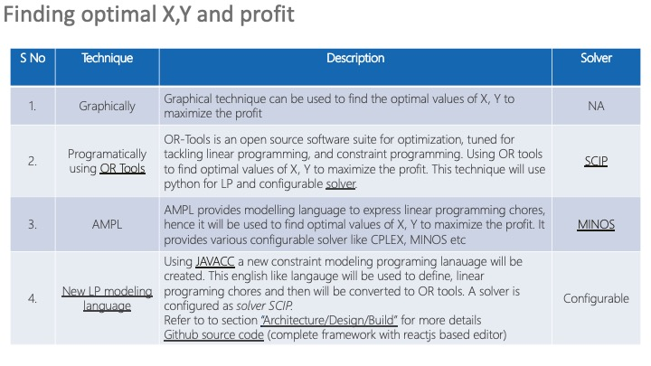
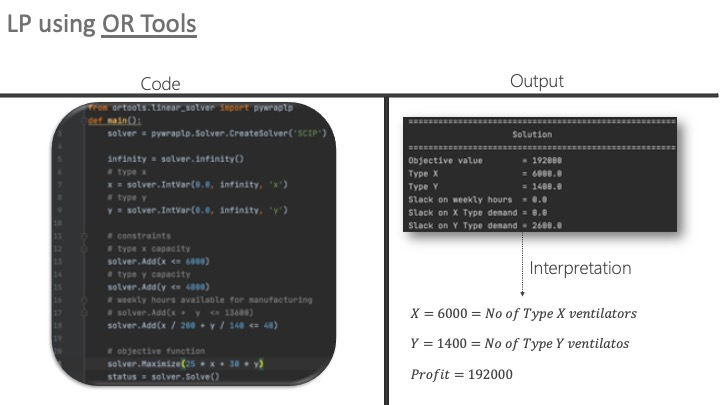
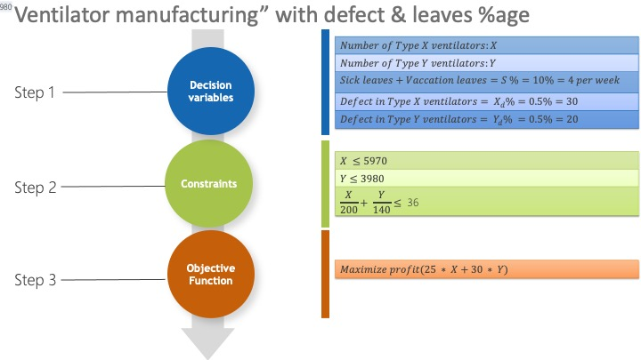
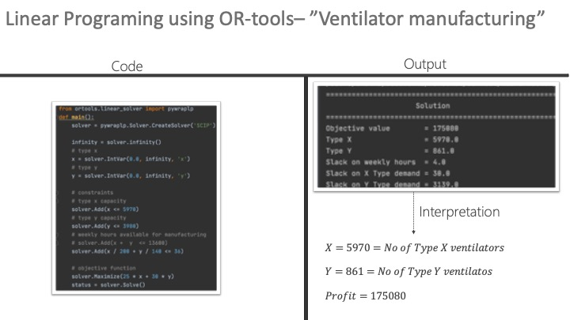
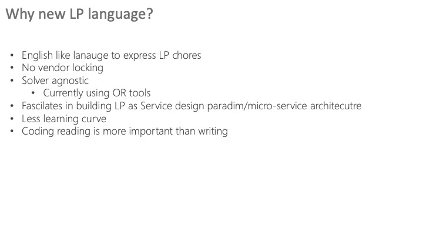

### Project Overview

A mechanical ventilator is a machine that can be used to support patients with severe respiratory conditions that impact the lungs, including pneumonia (which is a significant risk factor for COVID-19 patients). Before a patient is placed on a ventilator, medical staff will perform a procedure called intubation. After the patient is sedated and given a muscle relaxant, a tube is placed through the mouth and into the windpipe.

A lack of ventilators can endanger lives, so health authorities around the world are doing their utmost to procure more for medical facilities treating COVID-19 patients.

You work with a major car manufacturer, and the government has asked you for help in creating more ventilators in order to cope with the ventilator shortages in the hospitals in your country. Even though this is for public good, you also want to make sure that you are not putting your organisation at a financial risk in the process of developing these ventilators. As the head of finance, you have been asked to investigate ventilator options, the cost of producing them and the resources required to do so.

After some research, you found that there are many ventilator options available to attend to a variety of patient needs. Examples include:

- Home care ventilators
- Transport ventilators
- Low, medium and high-acuity ventilators
- High-frequency ventilators
- Non-invasive positive pressure ventilation/continuous positive airway pressure (NPPV/CPAP), biLevel positive airway pressure (BIPAP) systems
- Different ventilators also have different gas delivery designs, including turbine-based air supply and proportional solenoid (PSOL) valve control or a combination of the two systems.
- Costs for these ventilators can range from $5,000 to $50,000, but new developments indicate that comparable ventilators can be made using just $100 worth of parts. You discover a team from MIT that is doing exactly that, and they have published a paper with the specifications and descriptions of these ventilators.

You decide that if you want to manufacture these cheaper ventilators, you would do so by following a similar process. After some research, you realise that there are two production options for these cheaper ventilators. For simplicity, we will refer to these ventilator types as Type X and Type Y.

With the machinery you have right now, you see that you can create 200 Type X ventilators per hour and 140 Type Y ventilators per hour. After some calculations, you note that the profit per Type X ventilator is $25 and the profit per Type Y ventilator is $30. You have also discovered that in a week you can create a maximum of 6000 Type X ventilators and 4000 Type Y ventilators because of the person-hours and capacity of specialists available to you.

Note that you have only 40 hours per week to produce them.

### Elevator Pitch

